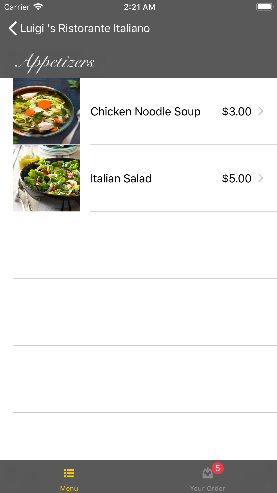

#  Restaurant Project

So far I 'm uploading the project at the final of part Four. 
In the next Days I'll update it for getting the rest of the parts done.

Happy week, happy coding ! =)

## So I made some mods on the weekend
 
 
 - Finished the example and start moding it. 
started to look around what were the workarounds and the good parts of the code...

I have to finish this TODAY !! 😖 (Finished at 16 of september but finished !!)

## So for getting the local server up and running

Since the App that came on the Resources folder didn't work, someone on reddit posted the solution in a python file. 
For running it, you just open a terminal and type the next command: 
'''
python OpenRestaurant.py

'''

## To Do's
- Part Six  (Done)
- Part Seven  (Done)
- Part Eight (Done)
- Part Nine (Done)
- Part Ten (At the middle, doing the setup of photografs)
- Extras : Optimized the color Pallette, added Images on Tab Bar, if image not catched draw a cacerole. YEEEII

** Fix image bugs!! **

- Happy coding and bum bum Happy Birthday Mexico, Happy Birthday to you ,  15 of September... 

